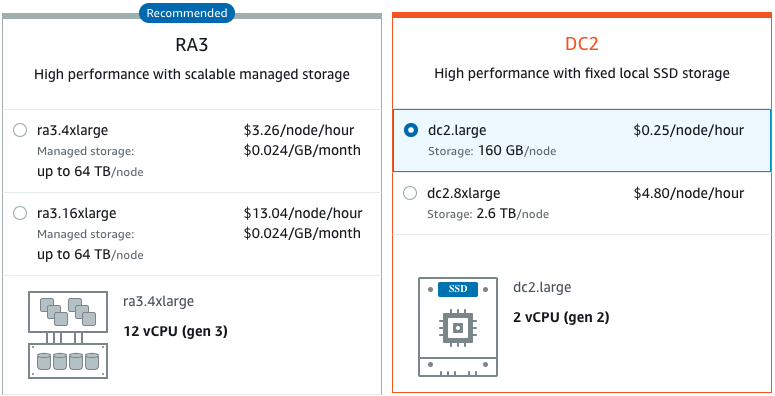

## Data Warehouse with AWS Redshift


### Description
A music streaming startup, Sparkify, has grown their user base and song database and want to move their processes and data onto the cloud. Their data resides in S3, in a directory of JSON logs on user activity on the app, as well as a directory with JSON metadata on the songs in their app.

The objective of this project is to build an ETL pipeline that **extracts data from a S3 bucket, stages them in Redshift, and transforms data into a set of dimensional tables** for the analytics team to continue finding insights in what songs their users are listening to. The AWS infrastructure will be constructed using the Infrastructure-As-Code approach using [boto3](https://github.com/boto/boto3), the AWS SDK for Python.


### Project datasets
Datasets in this project resides in S3. Here are the S3 links for each:
- Song data: s3://udacity-dend/song_data
- Log data: s3://udacity-dend/log_data
- Log data json path: s3://udacity-dend/log_json_path.json

**Song dataset**
The first dataset is a subset of real data from the [Million Song Dataset](http://millionsongdataset.com/). Each file is in JSON format and contains metadata about a song and the artist of that song. The files are partitioned by the first three letters of each song's track ID. For example, here are file paths to two files in this dataset.
```
song_data/A/B/C/TRABCEI128F424C983.json
song_data/A/A/B/TRAABJL12903CDCF1A.json
```
A single song file would look like the example below:
```json
{"num_songs": 1, "artist_id": "ARJIE2Y1187B994AB7", "artist_latitude": null, "artist_longitude": null, "artist_location": "", "artist_name": "Line Renaud", "song_id": "SOUPIRU12A6D4FA1E1", "title": "Der Kleine Dompfaff", "duration": 152.92036, "year": 0}
```

**Log dataset**
The second dataset consists of log files in JSON format generated by this [event simulator](https://github.com/Interana/eventsim) based on the songs in the dataset above. These simulate app activity logs from an imaginary music streaming app based on configuration settings.

The log files in the dataset you'll be working with are partitioned by year and month. For example, here are file paths to two files in this dataset.
```
log_data/2018/11/2018-11-12-events.json
log_data/2018/11/2018-11-13-events.json
```
Below is what a sample log data file looks like:


### Schema for song play analysis

To create a star schema optimized for queries on song play analysis, which includes the following tables:

- Fact Table
  1. songplays - records in event data associated with song plays i.e. records with page NextSong
    - songplay_id, start_time, user_id, level, song_id, artist_id, session_id, location, user_agent
- Dimension Tables
  2. users - users in the app
    - user_id, first_name, last_name, gender, level
  3. songs - songs in music database
    - song_id, title, artist_id, year, duration
  4. artists - artists in music database
    - artist_id, name, location, lattitude, longitude
  5. time - timestamps of records in songplays broken down into specific units
    - start_time, hour, day, week, month, year, weekday

### Project files
- ```create_table.py``` contains the scripts to create the fact and dimension tables for the start schema in Redshift.
- ```etl.py``` contains the scripts to load data from S3 into staging tables on Redshift and then process that data into the analytics tables on Redshift.
- ```sql_queries.py``` contains all the SQL statements, which will be imported into the two files above.
- ```Redshift_IaC.ipynb``` contains the "Infrastructure-As-Code" scripts to set up the AWS infrastructure needed for the project (i.e. IAM user, role, Redshift cluster).
- ```dwh.cfg``` contains the configuration data for the data warehouse ETL workflow

### The ETL pipeline
1. Implement the logic in ```etl.py``` to load data from S3 to staging tables on Redshift.
2. Implement the logic in ```etl.py``` to load data from staging tables to analytics tables on Redshift.
3. Test by running ```etl.py``` after running ```create_tables.py``` and running the analytic queries on the Redshift database.
4. Delete the Redshift cluster when completed.
