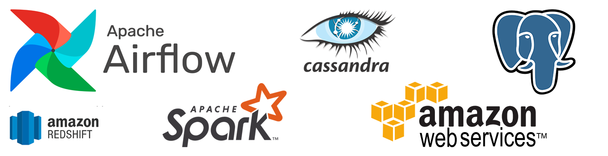

# Data Engineering Nanodegree Project Collection

### [Project 1 & 2 - Data Modeling with PostgreSQL & Apache Cassandra](https://github.com/chenliny/Udacity_Data_Engineering/tree/master/Data_Modeling)
In project 1 & 2, I perform data modeling on user activity data for a music streaming app called Sparkify. The [first project](https://github.com/chenliny/Udacity_Data_Engineering/tree/master/Data_Modeling/Project_1) focuses on a relational data model with Postgres and an ETL pipeline using Python. The [secong project](https://github.com/chenliny/Udacity_Data_Engineering/tree/master/Data_Modeling/Project_2) focuses on a NoSQL data model with Apache Cassandra and an ETL pipeline using Python.
**Skills: PostgreSQL, Apache Cassandra, ETL pipelines, data normalization/denormalization, Python**

### [Project 3 - Cloud Data Warehousing](https://github.com/chenliny/Udacity_Data_Engineering/tree/master/Data_Warehouse_Redshift)
In this project, I build a Data Warehouse on AWS cloud and an ETL pipeline that (1) extracts Sparkify’s data from S3; (2) stages them in Amazon Redshift; and (3) transforms them into a set of fact and dimensional tables.
**Skills: Amazon Redshift, AWS CLI, AWS SDK, Infrastructure-as-Code (IaC), Python, SQL**

### [Project 4 - Data Lakes with Apache Spark](https://github.com/chenliny/Udacity_Data_Engineering/tree/master/Data_Lake_with_Spark)
In this project, I build a Data Lake on AWS cloud and an ETL pipeline that (1) extracts data from S3; (2) processes them using Apache Spark; and (3) loads them back into S3 as a set of dimensional tables. The Spark process is then deployed on an AWS EMR cluster.
**Skills: Apache Spark, AWS EMR**

### [Project 5 - Data Pipelines with Apache Airflow](https://github.com/chenliny/Udacity_Data_Engineering/tree/master/Data_Pipeline_with_Airflow)
In this project, I automate a set of ETL data pipelines and data warehouse construction using Apache Airflow. The development process includes (1) configuring Airflow to automate data pipelines; (2) writing custom operators to perform tasks such as staging, loading, transformation, and validation.
**Skills: Apache Airflow, Amazon Redshift, Python, SQL**
